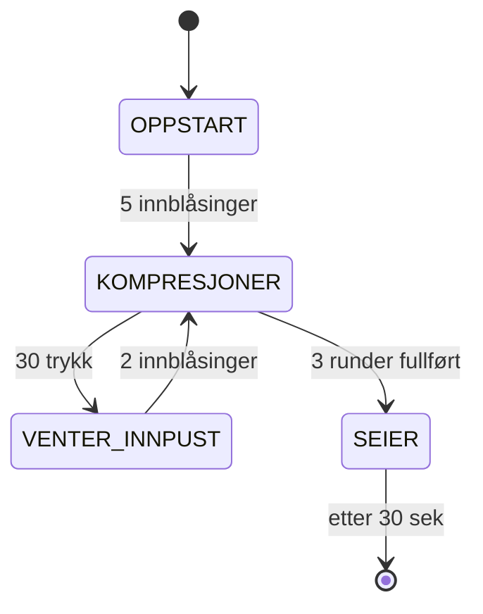

# HLR-simulator

En Arduino-basert HLR-treningssimulator som gir visuell og auditiv tilbakemelding på hjertekompresjonskvalitet og innpust. Systemet guider brukeren gjennom korrekt HLR-rytme ved hjelp av LED-strips, buzzer og ultralydsensor.

---

## Gruppe 1

- Albertine Thorsteinsen
- Eileen Kristoffersen
- Johannes Landmark Meldal
- Kaia Zhi Yang Sund
- Tobias Sigurd Hellstrøm Nordahl

---

## Innhold

- [Hardware](#hardware)
- [Tilstander](#tilstander)
- [Funksjoner](#funksjoner)
- [Justerbare verdier](#justerbare-verdier)
- [Avhengigheter](#avhengigheter)

---

## Hardware

| Komponent | Pin |
|---|---|
| 60-LED strip (WS2811, 12V) | D6 |
| 50-LED strip (WS2811, 12V) | D3 |
| 30-LED strip (WS2811, 12V) | D5 |
| Hjerteknapp | D2 |
| Passiv piezo-buzzer | D10 |
| HC-SR04 TRIG | D7 |
| HC-SR04 ECHO | D8 |

[Incredible Uusam Circuit Design.pdf](https://github.com/user-attachments/files/27244568/Incredible.Uusam.Circuit.Design.pdf)

---

## Tilstander

### OPPSTART
Brukeren må blåse 5 ganger i ultralydsensoren for å starte. Dette simulerer de innledende innblåsingene før HLR begynner. LED-stripen viser fremgang for hver innblåsing.

### KOMPRESJONER
Brukeren trykker på hjerteknappen 30 ganger. Systemet måler tempo og kvalitet på trykk og gir tilbakemelding via LED-farge og buzzer-takt. Ideelt tempo er 100–120 BPM (500–600 ms mellom hvert trykk).

### VENTER_INNPUST
Etter 30 kompresjoner venter systemet på 2 innblåsinger via ultralydsensoren. LED-stripen blinker for å indikere at innpust er nødvendig.

### SEIER
Etter 3 fullførte runder spilles en seiersmelodi og animasjonen går over til en grønn bølgeanimasjon i 30 sekunder, før systemet nullstiller seg automatisk.

---

## Funksjoner

### `lesKnapper()`
Leser hjerteknappen på D2 med 50 ms debounce for å unngå dobbeltregistrering. Leser også ultralydsensoren og registrerer innpust når noe kommer nærmere enn 7 cm. Innpust har 2 sekunders sperretid for å unngå dobbeltregistrering.

### `lesAvstand()`
Sender en ultralydpuls via HC-SR04 og måler returtiden. Returnerer avstand i centimeter. Hvis ingen respons innen 30 ms returneres 999 cm.

### `oppdaterKvalitet()`
Beregner kompresjonskvalitet basert på tidsintervall mellom trykk:

| Intervall | Kvalitet |
|---|---|
| 500–600 ms | Full score |
| For rask (< 500 ms) | Proporsjonal reduksjon |
| For sein (> 600 ms) | Gradvis reduksjon |

Oksygennivå øker ved innpust og synker gradvis under kompresjoner. De første 20 kompresjonene synker oksygenet sakte – fra kompresjon 20 til 30 øker forfallet gradvis.

### `oppdaterBuzzer()`
Spiller Stayin' Alive-takten (103 BPM) som bakgrunnspuls under kompresjoner:
- **Bakgrunn:** 1000 Hz, 80 ms – diskré taktpuls
- **Ved trykk:** 1200 Hz, 60 ms – bekreftelsestone, resynkroniserer takten

### `spillSeierLyd()`
Spiller en kort seiersmelodi (G5 – G5 – G5 – C6) når brukeren fullfører alle runder.

### `tegnBlodstrips()`
Animerer blodstrøm på 60-LED og 50-LED stripene. Fargen veksler mellom rød (høyt oksygen) og blå (lavt oksygen). Hastigheten øker med kompresjonskvaliteten.

### `tegnHLRstrip()`
Styrer 30-LED guidestripen med to indikatorer:
- **Luft-skala (LED 0–4):** Viser lungefylling. Blinker når innpust er nødvendig.
- **Hjerte-skala (LED 5–9):** Viser fremgang i kompresjonsrunden, fargeglidning fra rød til grønn.

### `tegnSeierstrip()`
Erstatter HLR-guidestripen med en grønn/blå bølgeanimasjon under seiersekvensen.

### `nullstill()`
Tilbakestiller alle variabler og tilstander til startverdier. Kalles automatisk etter 30 sekunder i seier-modus.

---

## Justerbare verdier

| Konstant | Standardverdi | Beskrivelse |
|---|---|---|
| `INNPUST_TERSKEL_CM` | 7 | Avstand i cm som trigger innpust |
| `IDEAL_MS_MIN` | 500 | Minimum ideelt intervall mellom trykk (ms) |
| `IDEAL_MS_MAX` | 600 | Maksimum ideelt intervall mellom trykk (ms) |
| `KOMPRESJONER_MAL` | 30 | Antall trykk per runde |
| `INNBLASNINGER_PR_RUNDE` | 2 | Innpust mellom hver kompresjonsrunde |
| `RUNDER_FOR_SEIER` | 3 | Antall runder før seier |
| `SEIER_VARIGHET_MS` | 30000 | Varighet på seieranimasjon (ms) |
| `KOMPRESJONER_NEDGANG` | 20 | Kompresjon nr. der oksygen synker raskere |

---

## Avhengigheter

### Biblioteker

| Bibliotek | Versjon | Bruk |
|---|---|---|
| [Adafruit NeoPixel](https://github.com/adafruit/Adafruit_NeoPixel) | Siste stabile | Styring av WS2811 LED-strips |

Installes via Arduino Library Manager: `Sketch → Include Library → Manage Libraries → søk "Adafruit NeoPixel"`.

Innebygde Arduino-biblioteker (ingen installasjon nødvendig):

| Bibliotek | Bruk |
|---|---|
| `tone()` / `noTone()` | Styring av passiv piezo-buzzer |
| `pulseIn()` | Lesing av HC-SR04 ultralydsensor |

---

## Verktøy og hjelpemidler

Koden er skrevet i Arduino C++. [Claude AI](https://claude.ai) har blitt brukt som hjelpemiddel underveis i utviklingen – primært til feilsøking, opprydding i kode og forslag til forbedringer.

---

## Tilkobling

> ⚠️ LED-stripene kjører på 12V og må ha egen strømforsyning. Koble alltid sammen GND fra Arduino og 12V-forsyningen (felles jord). Data-signalet går via 220Ω motstand fra Arduino-pin til strip.
